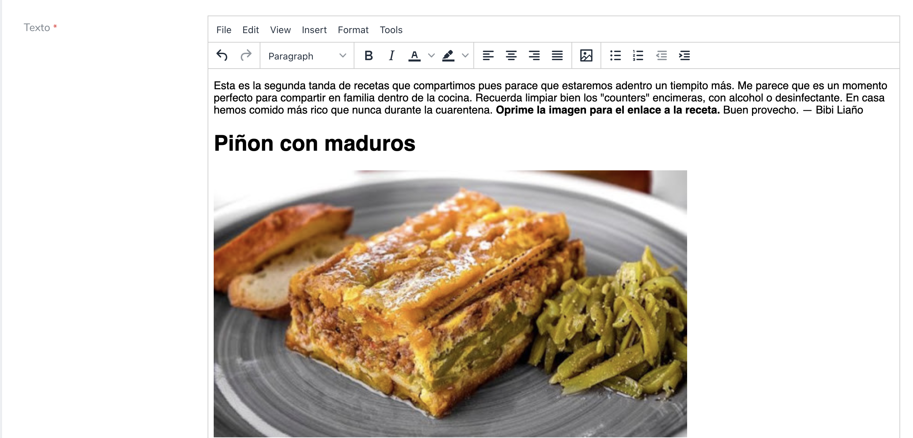

# Laravel Nova TinyMCE editor (with images upload capabilities!)

This Nova package allow you to use [TinyMCE editor](https://tiny.cloud) for text areas. You can customize the editor options and... you can **upload images to your server** and put them right there on the content without leaving the text editor!!


## Installation

```shell
composer require emilianotisato/nova-tinymce
```
Run the command bellow, to publish TinyMCE JavaScript and CSS assets.
```shell
php artisan vendor:publish --provider="Emilianotisato\NovaTinyMCE\FieldServiceProvider"
```

## Usage

In your Nova resource add the use declaration and use the NovaTinyMCE field:

```php
use Emilianotisato\NovaTinyMCE\NovaTinyMCE;

// ...

    /**
     * Get the fields displayed by the resource.
     *
     * @param  \Illuminate\Http\Request  $request
     * @return array
     */
    public function fields(Request $request)
    {
        return [
            ID::make()->sortable(),

            NovaTinyMCE::make('body'),
        ];
    }
```

By default, the editor comes with some basic options and the image management without the filemanager (inserted just as links).

You can use custome options like this:

```php
NovaTinyMCE::make('body')->options([
                'plugins' => [
                    'lists preview hr anchor pagebreak image wordcount fullscreen directionality paste textpattern'
                ],
                'toolbar' => 'undo redo | styleselect | bold italic forecolor backcolor | alignleft aligncenter alignright alignjustify | image | bullist numlist outdent indent | link'
            ]),
```

### Using the upload images feature with LFM

Now if you need to upload images from the text editor, we need to install [UniSharp Laravel Filemanager](https://unisharp.github.io/laravel-filemanager/installation), and pass the `use_lfm => true`  option to your options array:

```php
NovaTinyMCE::make('body')->options([
                'plugins' => [
                    'lists preview hr anchor pagebreak image wordcount fullscreen directionality paste textpattern'
                ],
                'toolbar' => 'undo redo | styleselect | bold italic forecolor backcolor | alignleft aligncenter alignright alignjustify | image | bullist numlist outdent indent | link',
                'use_lfm' => true
            ]),
```
#### ONLY if you use laravel-filemanager v1

If you use LFM v1 , the last step is to run this command to fix some Filemanager files: 
```shell
php artisan nova-tinymce:support-lfm
```

Finally you will need to update the `lfm_url` key to match the old url version like this `lfm_url' => 'laravel-filemanager`.

*IMPORTANT:* if you are in laravel 6 using laravel-filemanager v1, you will need to import the helper lib coz legacy Filemanager need them: `composer require laravel/helpers`.

## Optional Configuration

### Laravel Filemanager URL

Optional, in case you [change the laravel-filemanager URL](https://unisharp.github.io/laravel-filemanager/config) in the package config file (`config/lmf.php`), you need to pass that info to this nova field with the `lfm_url` key in the options array.

```php
// ...
    'use_lfm' => true,
    'lfm_url' => 'my-custom-filemanager-url'
// ...
```

### Override config file

In case you have in mind a default `options` array to load any time you instantiate the `NovaTinyMCE` field, you can optionally publish the config file and override the `default_options` array:

```bash
php artisan vendor:publish --provider="Emilianotisato\NovaTinyMCE\FieldServiceProvider" --tag="config"
```

This is the contents of the published config file:

```php
<?php

return [

    /*
    |--------------------------------------------------------------------------
    | Default Options
    |--------------------------------------------------------------------------
    |
    | Here you can define the options that are passed to all NovaTinyMCE
    | fields by default.
    |
    */

    'default_options' => [
        'content_css' => '/vendor/tinymce/skins/ui/oxide/content.min.css',
        'skin_url' => '/vendor/tinymce/skins/ui/oxide',
        'path_absolute' => '/',
        'plugins' => [
            'lists preview hr anchor pagebreak image wordcount fullscreen directionality paste textpattern'
        ],
        'toolbar' => 'undo redo | styleselect | bold italic forecolor backcolor | alignleft aligncenter alignright alignjustify | image | bullist numlist outdent indent | link',
        'relative_urls' => false,
        'use_lfm' => false,
        'lfm_url' => 'filemanager'
    ],
];
```

### Plugin customization

You can virtually pass any configuration option for the javascript SDK to the array in the `options()` method.

For example, you like to have increased the height of the text area:

```php
            NovaTinyMCE::make('body')->options([
                'height' => '980'
                ]),
```

You can see the full list of parameters in the docs:
[https://www.tiny.cloud/docs/configure/](https://www.tiny.cloud/docs/configure/)

### Using JSON syntax on attribute property

If you use JSON syntax on attribute name, TinyMCE won't initialize because the default id will be an invalid HTML id attribute. 
To solve this you can define a custom id. For example:

```php
    NovaTinyMCE::make('Value', 'text->en')->id('custom-id');
```
 
